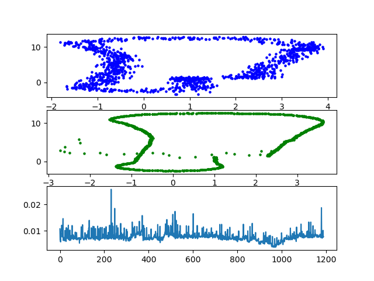
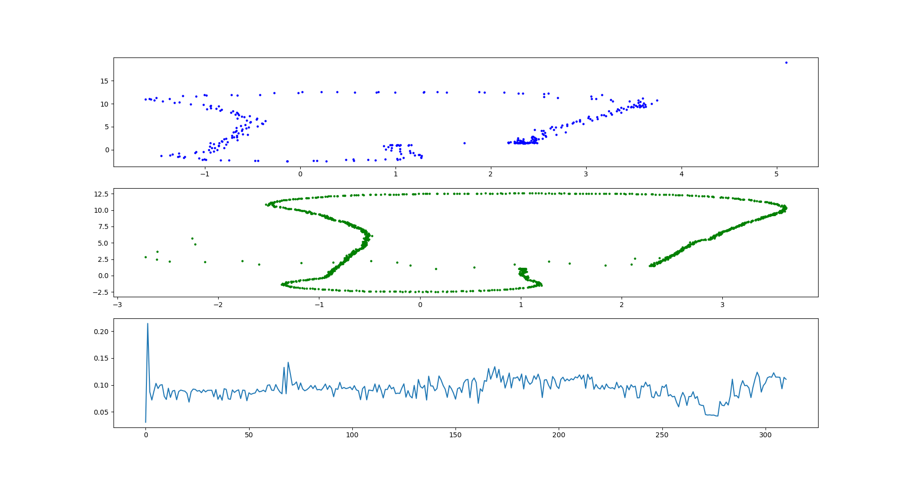
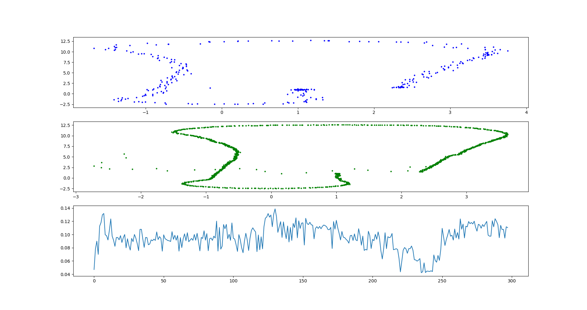
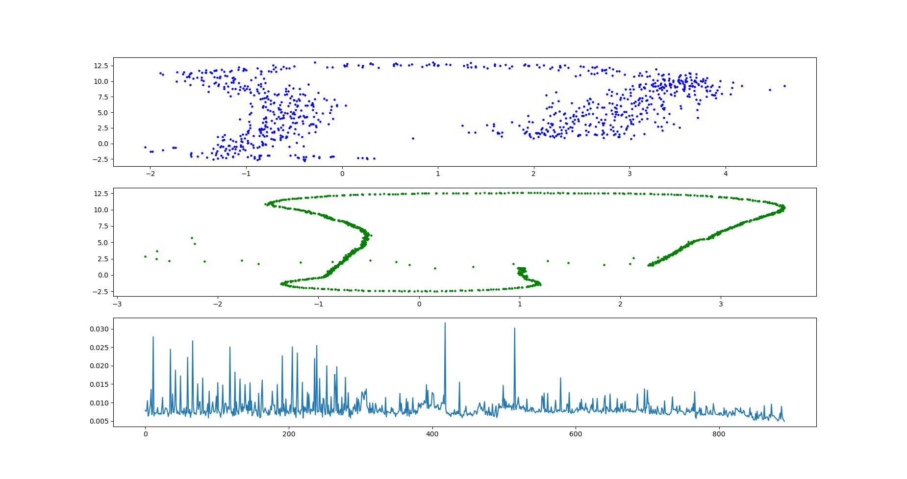
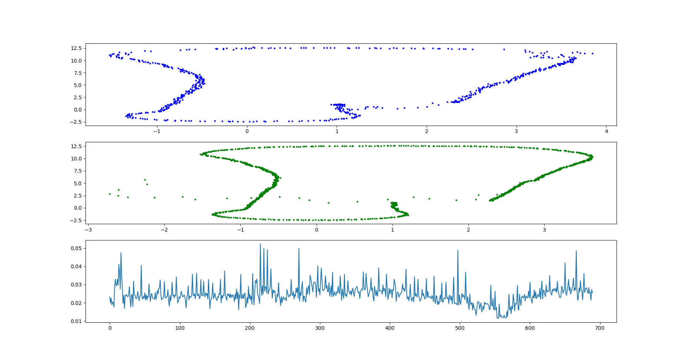
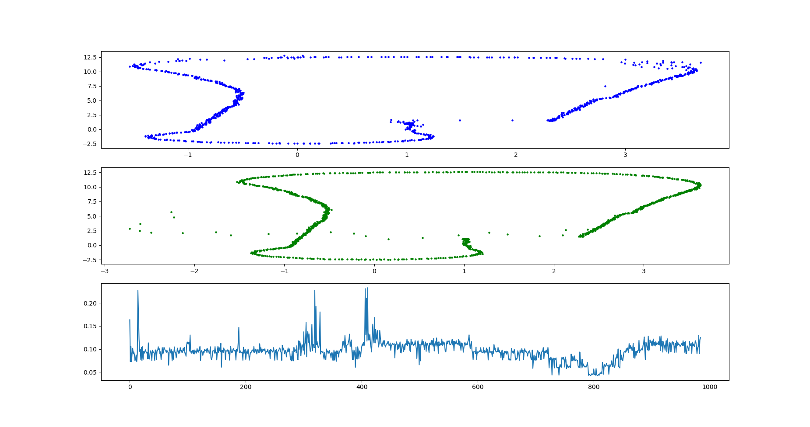
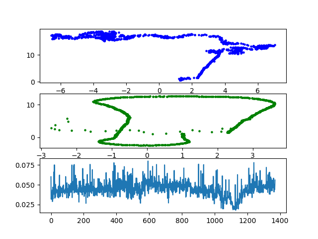
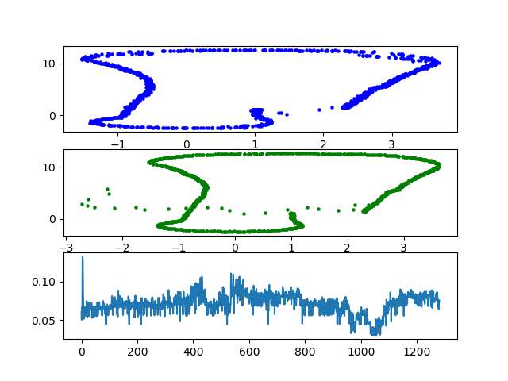

Academic Year: 2025/2026

# Report on Particle Filter assignment development

## Step 1: Basic requirements implementation

- **Description**:

  I was able to implement the basic requirements of the assignment. The result is acceptable however it is really really noisy compared to the "best output" we were given by the professor.
The parameters are the following: 

  ``` c++
  #define NPARTICLES 100
  // #define RANDOM_INIT // comment this line to turn random initialization OFF
  double sigma_init [3] = {0.80, 0.80, degrees_to_radiants(6)};  //[x,y,theta] initialization noise.
  double sigma_pos [3]  = {.50, .50, degrees_to_radiants(20)}; //[x,y,theta] movement noise. Try values between [0.5 and 0.01]
  double sigma_landmark [2] = {0.30, 0.30};     //[x,y] sensor measurement noise. Try values between [0.5 and 0.1]
  ```

- **Results**:

  

- **Comments**: The result appears to be really noisy both on the localization and the orientation graph.


- **Next steps**:

  - Try to squeese all the performance from the basic PF  

    1. compare non random init to random init performance
    2. understand how to make the PF less "shaky"
    3. play around with parameters such as: more particles vs less particles

  - Try to implement algorithmic improvements in order to surpass the basic implementation of the PF

    1. implement a better distance metric
    2. implement a stocastic resampling + number of particles decay-> resampling wheel is stocastic when picking the particles but does not add noise to the particle itself. That step is delegated to the prediction step but it would be interesting to try to add extra noise to a small percentage of particles.

## Step 2: Try to squeese all the performance out of the basic PF  

### Scenario 1:

**IDEA:**
See how the filter behaves with random initialization

**First try**

- **Descirption**: I will keep all the parameters like before and use random initilization
  ``` c++
  #define NPARTICLES 100
  #define RANDOM_INIT
  double sigma_init [3] = {0.80, 0.80, degrees_to_radiants(6)};  // does not matter in this scenario
  double sigma_pos [3]  = {.50, .50, degrees_to_radiants(20)}; //[x,y,theta] movement noise. Try values between [0.5 and 0.01]
  double sigma_landmark [2] = {0.30, 0.30};     //[x,y] sensor measurement noise. Try values between [0.5 and 0.1]
  ```
- **Results**: The robot is completely unable to localize itself
- **Comments**: The number of particles might be not enough -> no particles land near the ground truth position.

**Second try**

- **Description**: Try to initialize x50 particles in oder to have more probability of landing in a position near the ground truth
  ``` c++
  #define NPARTICLES 5000
  // same as before
  ```

- **Results:**: The robot is still completely unable to localize itself
- **Comments**: Since increasing the number of particles did not work I think we need to also work on the other parameters. The problem is that the difference between `initial_guess_init` and `random_init` is bigger than I thought. When we initialize with a solid starting guess we want:

  - Some exploration guided towards the initial guess
  - Small update uncertainty
  - Strong trust in sensors
  - Fast convergence (exploitation)

  On the other hand when we initialize randomly we want:
    - Much more exploration in all directions
    - Big update uncertainty in order to keep exploring
    - Less trust in sensors (not because sensors are worse but to give "bad" particles a chance to survive next iteration)
    - Slow convergence
  

**Third try**
- **Description**: Try to keep a high number of particles and tune the prediction uncertainty and the landmark uncertainty
  ``` c++
  #define NPARTICLES 5000
  #define RANDOM_INIT
  double sigma_init [3] = {0.80, 0.80, degrees_to_radiants(6)};  // does not matter in this scenario
  double sigma_pos [3]  = {.50, .50, degrees_to_radiants(30)}; //[x,y,theta] movement noise. Try values between [0.5 and 0.01]
  double sigma_landmark [2] = {1.0, 1.0};     //[x,y] sensor measurement noise. Try values between [0.5 and 0.1]
  ```

- **Results**: The robot is now able to localize itself

  

- **Comments**: The result is even better than the base implementation as it shows much less noise on both the localization and the orentation graph, as well as more precise guesses compared to the ground truth graph


---
### Scenario 2:

**IDEA:**
I want to see what happens if I keep the same parameters and go back to non-random init

**First try**

- **Description**:

  ``` c++
  #define NPARTICLES 5000
  // #define RANDOM_INIT
  double sigma_init [3] = {0.80, 0.80, degrees_to_radiants(6)};
  double sigma_pos [3]  = {.50, .50, degrees_to_radiants(30)}; //[x,y,theta] movement noise. Try values between [0.5 and 0.01]
  double sigma_landmark [2] = {1.0, 1.0};     //[x,y] sensor measurement noise. Try values between [0.5 and 0.1]
  ```

- **Results**: The robot is able to localize itself 

  

- **Comments**: The result is really similar to the result of the random init. It is worth noting that the two orientation graphs appear more different, however I think it is due to the fact that the random init graph has a big spike at the beginning due to the fact that the initial orientation is random and it needs some time to adjust. 

  I wonder if what would happen if I brought the number of particles back down to 100.

- **Observations**: Compared to the basic PF implementation, the results of the last two scenarios appear to be much less noisy. I wounder if they only appear to be less noisy because I have less samples (due to the fact that using more particles is more computationally expensive)

**Second try**

- **Description**: I want to see what happens when I keep all the parameters as they are now, and I just lower the number of particles back to 100. I expect to go back to a much more noisy graph.

  ``` c++
  #define NPARTICLES 100
  // same as before
  ```
- **Results**: To no-one's surprise the result is back to beign super noisy

  

- **Comments**:
Reducing the numer of particles allows the algorithm to run much faster -> more odometry samples. The reason why the result is so noisy is because we don't trust the landmarks positions but we also introduce a lot of noise in the prediction.

- **Conclusions**:
The random init model benefits from having low "trust" in what it is doing and is able to compensate when a large number of particles are used.
In the non-random init model it makes no sense to have low trust in the landmarks and in the model. 

- **Next**: I want to go back to non-random init, raise the number of particles a bit and try to tighten the parameters.
---
### Scenario 3:

**IDEA**: Let's go back to non-random init, raise the number of particles and try to tighten the paramerters 

**First try**

- **Description**: 
  ``` c++
  #define NPARTICLES 1000
  // #define RANDOM_INIT
  double sigma_init [3] = {0.30, 0.30, degrees_to_radiants(5)};  //[x,y,theta] initialization noise.
  double sigma_pos [3]  = {.15, .15,  degrees_to_radiants(5)}; //[x,y,theta] movement noise. Try values between [0.5 and 0.01]
  double sigma_landmark [2] = {0.15, 0.15};     //[x,y] sensor measurement noise. Try values between [0.5 and 0.1]
  ```
- **Results**: I am pretty satisfied with the result because it has small noise and it is very accurate

  

- **Comments**: The two graphs appear shifted but actually it is just because they have a different scale. Looking at the number is clear that the two graphs are very similar.

- **Next**: Let's see what happens if we raise the number of particles. My prediction would be that it will become slightly better, but we will not see a massive improvement.

**Second try**

- **Description**: I just raised the number of particles by a x5 factor
  ``` c++
  #define NPARTICLES 5000
  // #define RANDOM_INIT
  double sigma_init [3] = {0.30, 0.30, degrees_to_radiants(5)};  //[x,y,theta] initialization noise.
  double sigma_pos [3]  = {.15, .15,  degrees_to_radiants(5)}; //[x,y,theta] movement noise. Try values between [0.5 and 0.01]
  double sigma_landmark [2] = {0.15, 0.15};     //[x,y] sensor measurement noise. Try values between [0.5 and 0.1]
  ```
- **Results**: I am really satisfied by the result

  
Increasing the number of particles allowed to get an even less noisy and more precise result. 

  It is still important to notice that the orientation graph experiences very bigger jitter compared to the prevoius experiment, I believe that this is due to the fact that the computational toll is high on my pc so it sometimes lags behind and gets lost for a moment. This is not noticible on the position graph because the particles are very near to each other therefore picking the wrong one for just one iteration does not make a difference, while in the orientation graph if I pick a particle with the wrong orientation even for one iteration I can spot it immediately because it draws a big spike in my graph.

- **Comments**: The first time I tried with these settings my pc was in power saver mode and I also sped up the bag up to x4.3 in order to conduct my experiment quicker. Needles to say my pc started to lag behind and the robot got completely lost.

**Third try**:

- **Description**: I want to go back to a sligtly smaller number of particles in order to give my pc some breathing room and try to tighten the parameters even more.
  ``` c++
  #define NPARTICLES 2000
  // #define RANDOM_INIT
  double sigma_init [3] = {0.25, 0.25, degrees_to_radiants(5)};  //[x,y,theta] initialization noise.
  double sigma_pos [3]  = {.10, .10,  degrees_to_radiants(3)}; //[x,y,theta] movement noise. Try values between [0.5 and 0.01]
  double sigma_landmark [2] = {0.10, 0.10};     //[x,y] sensor measurement noise. Try values between [0.5 and 0.1]
  ```
- **Results**: The robot got lost

  

- **Comments**: I tried to push too much the boudaries of the base PF implementation and the algorithm bumped into a wall. This could be also due to the fact that even with 2000 particles my pc is a bit struggling but since we were able to get a valid result with 5000 I don't think computational toll is the problem here.

**Fourth Try**

- **Description**: I want to try one last experiment in order to find the best "stable" version of my vanilla PF. For this purpose I decided to backtrack a bit on my parameters by trying a sligtly softer approach:

  ``` c++
  #define NPARTICLES 2000
  // #define RANDOM_INIT
  double sigma_init [3] = {0.30, 0.30, degrees_to_radiants(30)};  //[x,y,theta] initialization noise.
  double sigma_pos [3]  = {.15, .15,  degrees_to_radiants(10)}; //[x,y,theta] movement noise. Try values between [0.5 and 0.01]
  double sigma_landmark [2] = {0.20, 0.20};     //[x,y] sensor measurement noise. Try values between [0.5 and 0.1]
  ```

- **Results**: This result is good enough for it to be considered the "stable version" of my PF

  

  The localization is really solid and the orientation graph is stable.

### Final condsiderations on "Step 2"

The experiments in Step 2 successfully squeezed the maximum performance from the "vanilla" particle filter implementation. This process revealed three critical (and interconnected) trade-offs that govern filter performance:

1. Exploration (Global) vs. Exploitation (Local): My experiments confirm that Global Localization (random init) and Local Localization (gps init) are two fundamentally different problems that require separate tuning:

    - Global Localization requires high exploration. It  required a big number of particles and high-noise parameters in order to to be forgiving to particles far from the truth. This prevents an early collapse.

    - Local Localization requires more exploitation. Once the pose is known, the filter's job is to track it. This requires trust in prediction step  and trust in the sensors. Using Global parameters for a Local problem results in a noisy, estimate.

2. Particle Count vs. Computational Cost: The number of particles is a direct trade-off between accuracy and stability on one hand, and computational lag on the other.


3. The Danger of Over-Confidence: In an attempt to get a perfect result, I tightened the parameters too much. When a normal, small odometry drift occurred, the entire particle cloud (which was too small) missed the true pose. Because the sensor trust was also too high, it assigned a weight of near zero to all 2000 particles, causing a total filter collapse. By relaxing the parameters a bit I was able to find the "sweet spot" and obtain a stable solid version.

4. BONUS: I performed some code clean-up and I removed some useless calls that generated random numbers. By doing so I think I unintentionally messed up all the code relying on randomness because the robot had a harder time localizing itself and I had to tune the parameters again.

---

## Step 3: Algorithmic Improvements

### Implement different resampling method

I decided to implement the *stratified resampling* algorithm described in this source documentation: https://ieeexplore.ieee.org/document/7079001

The idea bihind the algorithm is the following:

1. We take the particles weights, we compute the cumulative weights and we normalize them. This way we create our stratification
2. We divide the cumulative weights interval in num_particles segments.
3. Each segment will fall in a certain stratification. We sample as many particles of that stratification as the number of segments falling into it.

**Resampling wheel vs Stratified Resampling**

  - *Resampling Wheel*: Each spin of the wheel is a fully independent random draw. 
    - Pros: Very simple
    - Cons: Because every pick is fully random, it can happen that in a single spin you pick a high-weight particle all the times and a medium-weight particle 0 times. If this happens we kill all the particles that were good, but didn't recieve a maximum weight at this iteration

- *Stratified resampling*: It divides the entire probability (0.0 to 1.0) into N equal-sized bins. It then draws exactly one random sample from each bin and looks up the correspondent probability strata. 
  - Pros: Much lower variance. It's guaranteed to select a much more representative and evenly-spread set of particles, closely matching the true probability distribution. This significantly reduces "jitter" and is more stable.
  - Cons: Slightly more complex.

- **Result**


  The result does not appear to have changed that much however I tryed playing around with the "stable" parameters and the algorithm appears to be less influenced by small parameters shifts.

### Implement different data association technique
